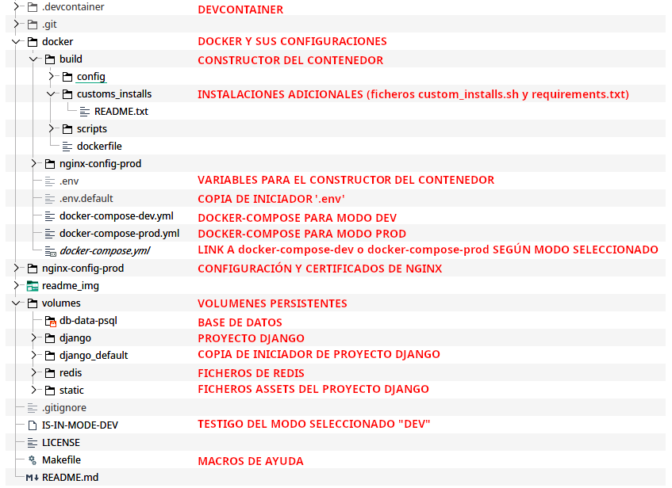
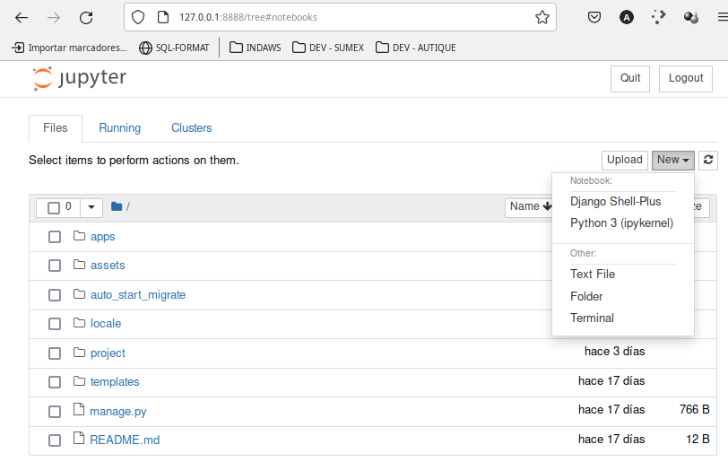
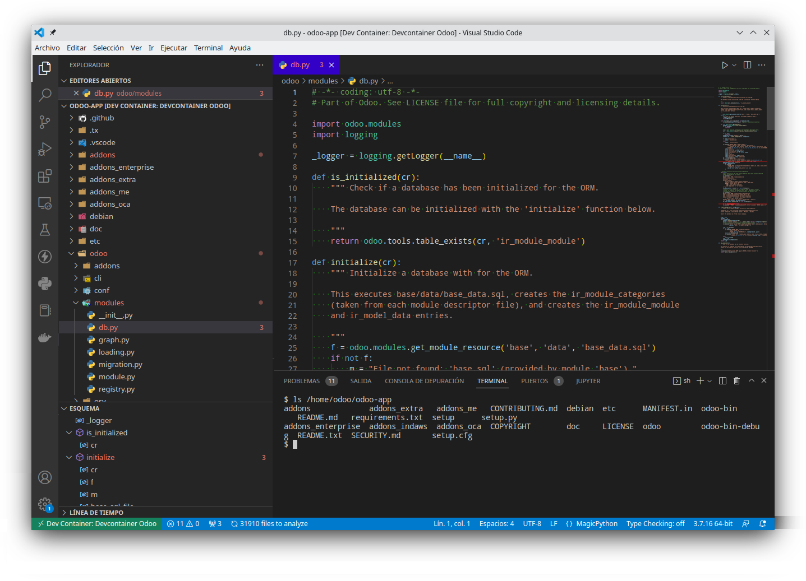

# Docker compose para Django (Desarrollo y Producción)

Por Pedro Reina Rojas (apachebcn@gmail.com)


## Características

Características para el entorno Docker:

- Python 3.7 (Seleccionable desde Dockerfile)
- Django 3.2 (Seleccionable desde requirements.txt)
- PostgreSql 12.3 (Seleccionable desde docker-compose)
- docker-compose-traefik.yml es detectado y ejecutado automáticamente vía Makefile
- PgAdmin 4 (opcional desde docker-compose)
- Cambio automático entre DEV/PROD desde comando Makefile
- docker-compose  independiente para los modos Dev/Prod
- Iniciador migrations Django (desde make django_migrations_start)
- Instalaciones adicionales desde docker/build/customs_installs/customs_installs.sh y docker/build/customs_installs/requirements.txt
- Entrada rápida a bash del contenedor Django y Django-shell (desde Makefile)
- Ayuda rápida para git pull y git reset del proyecto Django (desde Makefile)
- Variables debug, debug_toolbar y debug_ptvsd desde fichero .env
- Redis
- Jupyter
- DevContainer


Características para el proyecto Django:

- [x] Ejemplo inicial en volumes/django_default, para copiar o linkar
- [x] Wsgi
- [x] Gettext
- [x] Admin Honey Pot
- [x] Preconfiguración de Flake8 para Visual studio Code
- [x] Django extensions 
- [x] Redis
- [x] DebugBarTool configurado para modo Dev
- [x] Ptvsd configurado para modo Dev y para devcontainer
- [x] Werkzeug configurado sin Pin para modo Dev
- [x] Nginx configurado para modo Prod
- [x] Extensiones Visual Studio Code desde carpeta .vscode y desde .devcontainer
- [x] Configuraciones Visual Studio Code desde carpeta .vscode y desde .devcontainer


## ¿Por que Django en Docker?

Porque Docker nos permite una gran movilidad, simpliciad, y rapidez en el despliegue de nuestros proyectos en cualquier servidor.<br>
También nos simplifica el hacer un backup de todo el entorno, o clonarlo en cualquier lugar (Proyecto, configuración, base de datos, y todo el entorno completo)


## Presentación

Este diseño facilita la rápida conmutación entre los modos **DEV** y **PROD**, personalizando el entorno y la configuración de Django.<br>

**Dev** funciona directamente con django como servidor con runserver_plus escuchando en puerto 8000 (para testeo y debug)<br>
**Prod** funciona con django-uwsgi escuchando con puerto 8000 con Nginx como puerto reverso. (para entorno de producción)<br>

El comando que se ejecuta en consola desde la raiz del proyecto,  **make dev** y **make prod**, conmutan estos 2 modos sin necesidad de recompilar la imagen.<br>
En esta conmutación automática se crean el enlace .docker-compose.yml que apunta a los ficheros docker-compose-dev.yml o docker-compose-prod.yml según el modo seleccionado.<br>
Y al mismo tiempo se genera un link, **IS-IN-MODE-DEV** o **IS-IN-MODE-PROD**, para dejar como testigo visual cual es el modo seleccionado actual.<br>

Ejemplo




## Iniciar proyecto

### Configurar el entorno🔧

#### build/dockerfile

Abrimos **build/dockerfile** y en la linea nº1 especificamos la versión de python.

#### build/config

Abrimos **build/config/requirements.txt** y especificamos las versiones de:

```
django==3.2.15
uwsgi==2.0.17.1
psycopg2-binary==2.8.5
flake8==3.2.1
```

Creamos o editamos los ficheros para instalaciones adicionales:

- build/customs_installs/customs_installs.sh
  - insertamos lineas de apt-get (ejemplo: apt-get install git)

- build/customs_installs/requirements.txt
  - insertamos lineas de pip o pip 3 install (ejemplo: pip3 install django-forms)

*Estos ficheros están en .gitignore para que el repositorio no lo recoga los cambios producidos por el usuario, ya que estos determinan la configuración local del proyecto del usuario.*<br>
*Así que cuando hagamos un "git pull" a este repositorio, no habrá problemas ni conflictos por los cambios en este fichero.*


#### Entorno Docker (fichero docker/.env)

Abrimos el fichero **docker/.env** (si no existe, lo copiamos de **docker/.env.default**)

Y lo configuramos:

```
COMPOSE_PROJECT_NAME=project_X
CONTAINER_NAME=project_X
DJANGO_HOSTNAME=project_X.localhost

# public postgresql port
EXPOSE_PUBLIC_PORT_DB=8884

# public django ports in dev mode
EXPOSE_PUBLIC_DEV_PORT_DJANGO_RUNSERVER=800
EXPOSE_PUBLIC_DEV_PORT_PTVSD=3002
EXPOSE_PUBLIC_DEV_PORT_DJANGO_JUPITER=8888

# public django ports in prod mode
EXPOSE_PUBLIC_PROD_PORT_NGINX=800
EXPOSE_PUBLIC_PROD_PORT_NGINX_SSL=4430

# postgresql parameters
POSTGRES_VERSION=12.3
DB_ENGINE=django.db.backends.postgresql_psycopg2
DB_NAME=postgres
DB_USER=postgres
DB_PASSWORD=xxxxxxxx

# Django settings
DJANGO_DEBUG=False
DJANGO_DEBUG_TOOLBAR=False
DJANGO_PTVSD_DEBUG=False

```

*El último parrafo es atendido por django settings*


#### Entorno Docker (docker/docker-compose)

***Este punto no es necesario tratarlo.<br>
Sólo es a nivel de conocimiento.***

El fichero docker-compose.yml será un link que apunta a docker-compose-dev.yml o docker-compose-prod.yml.<br>
Si no existe este fichero, no te preocupes, se generará solo al arrancar el proyecto con "make dev" o "make prod"<br>
En cualquier caso, **NO EDITES DIRECTAMENTE docker-compose.yml**<br>

Podemos revisar y editar **docker/docker-compose-dev.yml** y **docker/docker-compose-prod.yml**
Pero todo está pensado para no tener que modificar estos ficheros.<br>

Algo muy util en estos ficheros, es la variable MODE, cuyo valor es el modo seleccionado (dev o prod)<br>
Esta variable es visible dentro del entorno Django.<br>
De hecho está usandose en el fichero settings.py

Foto (docker/docker-compose-dev.yml) donde se asigna la variable "MODE" con valor "dev" o "prod"


#### django_default

La carpeta volumes/django_default es un referente necesario para aplicar cosas a tu proyecto inicial Django.<br>
Copia de esta carpeta "django_default" lo que te interese aplicar a tu proyecto, a tu carpeta volumes/django, o también puedes linkarlo.

- **.vscode**<br>
  - Contiene
    - extensions.json: <br>La recomendación de aplicaciones a instalar. (Visual Code te ofrecerá la respectiva sugerencia)
    - launch.json:<br> 2 modos de debug:
      - Debug para el proyecto cargado como carpeta
      - Debug para el proyecto cargado como devcontainer
    - settings.json:<br>Configuración de Visual Code, entre ellos la configuración de Flake8
- **project**<br>
  Ejemplo de la carpeta project donde se encuentra el settings.py, urls.py, etc...<br>
  Cópialo a tu proyecto y personalízalo.<br>
  Este settings está diseñado de tal forma que usa las variables del .env de docker.
- **auto_start_migrate**<br>
  Carpeta necesaria en tu proyecto, para que funcione el comando "make django_migrations_start"
  También necesita la variable "AUTOSTARTMIGRATE" en project/settings.py


#### django_settings

Todos los proyectos django necesita tener el settings.py configurado para el proyecto, así como la carga de aplicaciones.<br>
Idealmente copiar volumes/django_default/project y personalizar.


#### Arrancar docker con django configurado

Simplemente en consola, escribimos:

```
make dev
```

ó

```
make prod
```

ó si ya tienes un modo seleccionado:

```
make up
```


#### Iniciar la base de datos con los modelos del proyecto

Si el proyecto es nuevo, puede que Django haga automaticamente las migraciones de modelos a base de datos.<br>
En algunas ocasiones no lo hace o no lo hace por completo.<br>
Para iniciar las migraciones, usamos el script "auto start migrations"<br>
Ejecutando el comando

```
make django_migrations_start
```


## Comandos make

- make start<br>
  Ejecuta docker-compose start 
- make stop<br>
  Ejecuta docker-compose stop
- make up<br>
  Ejecuta docker-compose up (adjunta automaticamente docker-compose-traefik.yml) 
- make down<br>
  Ejecuta docker-compose down 
- make up_build<br>
  Ejecuta docker-compose up --build 
- make RESTART<br>
  Borra la base de datos, los ficheros de caché, y la carpeta volumes/static<br>
  La idea es borrar un proyecto existente e iniciar uno nuevo
- make ps<br>
  Ejecuta docker-compose ps 
- make log<br>
  Ejecuta docker-compose logs -f --tail=1000 
- make dev<br>
  Compila y arranca en modo dev 
- make prod<br>
  Compila y arranca en modo prod 
- make django_bash<br>
  Bash en contenedor django como user django 
- make django_bash_root<br>
  Bash en contenedor django como user root 
- make django_shell<br>
  Shell django en el contenedor de django 
- make django_jupyter<br>
  Inicia instancia de Jupyter
- make django_create_superuser<br>
  Ejecuta manage.py createsuperuser en contenedor de django 
- make django_git_pull<br>
  Ejecuta git pull en volumes/django 
- make django_git_pull_force<br>
  Ejecuta git pull --force en volumes/django/git pull 
- make django_git_reset<br>
  Ejecuta git reset --hard origin/master en volumes/django
- make django_migrations_remove<br>
  Borra todos los ficheros migrations de todos los modelos de django 
- make django_migrations_start<br>
  Borra todos los ficheros migrations y recrea nuevamente los migrations/migrate/migratesql de todos los modelos de django 
- make django_graph_models<br>
  Crea el fichero myapp_models.png con la relación de modelos de Django 
- make postgres_bash<br>
  Bash en el contenedor postgresql como user postgres 
- make postgres_shell<br>
  Bash en el contenedor postgresql como user postgres 
- make postgres_backup<br>
  Crea una copia de /volumes/db-data-psql en formato tar.gz 
- make redis_bas<br>
  Bash en el contenedor redis como user root 
- make redis_monitor<br>
  Bash con monitor de redis
- make redis_clear<br>
  Flush cache de Redis 
- make fix_folders_permissions<br>
  Arreglar permisos en carpetas


## Probar Django

Tras levantar el contenedor de docker con **make dev**/**made prod** o  **make up**<br>

Introducimos en el navegador http://locahost:804 (o el puerto que hayamos seleccionado)<br>

Página por defecto de Django


## Reiniciar la base de datos

1. make down (Parar la instancia del contenedor)
2. rm -R volumes/nginx-config-prod (Borrar el contenido del volumen postgresql)
3. make up (Volvemos a levantar el contenedor de docker)

Y la base de datos vuelve a crearse de nuevo, pero solo se generan las tablas del entorno de Django, con el sistema de usuarios y el admin.<br>
Las tablas de nuestro proyecto las tenemos que volver a sincronizar con `makemigrations` `migrate` y `sqlmigrate`


## Reiniciar un proyecto existente


1. make down (Parar la instancia del contenedor de docker)
2. make RESTART (Borra el contenido del volumen postgresql, redis y static)
3. make up (Vuelve a levantar el contenedor de docker)


## Rutas de imagenes


### static

Almacenamiento de los assets estáticos.<br>
Un asset es el tipo de ficheros que se cargan al navegador, osea, los img, css, js .<br>
En nuestro settings.py bajo el comentario \"# Rutas" veremos las rutas que Django va a usar para la ruta de assets estáticos.<br>

Los assets inicialmente serán para los vendors y subaplicaciones, tal como puede ser debug_toolbar y bootstrap.<br>
Pero también incluiremos aquí los assets de nuestro projecto, que en este entorno se ha decido que sea **volumes/django/assets/static/project**<br>
Cuando Django esté en modo **prod**, ejecutará automaticamente `collectstatic`.<br>
`collectstatic` copia la ruta local static a la ruta externa static.<br>
En esta caso de **volumes/django/assets/static** =>**volumes/static**<br>
Lo que llamo ruta externa static es lo que nginx va a usar.<br>
En el caso de que django cargue un asset en modo 'dev' y en modo 'prod' nos devuelva un error 404, probablemente será porque en este static externo no existe físicamente el asset.


### media

**En volumes/django/assets/media**

Lo usaremos para los ficheros que se suben con "upload",  ficheros de usuarios y etc.<br>

Es necesario que .gitinore excluya todos los archivos de /volumes/django/assets, pero incluyendo aquella carpeta que uses para tus assets.<br>
El .gitignore actual, describe lo siguiente:<br>
assets/media<br>
assets/static/*<br>
!assets/static/project<br>


## Debug

Y para activar o desactivar Debug, en el fichero .env:

```
DJANGO_DEBUG=True
```


## DebugToolBar

Para activarlo, en el fichero .env:

```
DJANGO_DEBUG_TOOLBAR=True
```


## Debug con Ptvsd

en el fichero .env:

```
DJANGO_PTVSD_DEBUG=True
```

Y reiniciamos el contenedor.

Y en Visual Code seleccionamos el debuger que nos interesa (foto siguiente)  con el puerto especificado.<br>
Se entiende que remoteRoot (la ruta en el contenedor) es /srv/project, debiendose cambiar si tu proyecto en el contenedor difiere de esta ruta.


Acto seguido y como es popularmente sabido, marcamos los puntos de interrupción en los ficheros, y hacemos click en el icono "play" del debug.


## Jupyter

Jupyter nos permiten 2 cosas muy utiles:

- Navegar por los ficheros de Django como si el contenedor fuese un ftp, y nos permite crear carpetas y subir y editar ficheros.
- Usar un interprete tal como django_bash, pero gráficamente, insertando o pegando varias lineas para ejecutarlo como si fuese un IDE.  

Jupyter se ejecuta gracias a la configuración de Docker, y a unas lineas de especificaciones en project/settings.py
*(En volumes/django_default/project/settings.py podemos encontrar estas lineas bajo el comentario #jupyter)*

Ejecutar en consola en el directorio del proyecto

```
make django_jupyter
```

Deberá aparecer algo así:


Entonces pondremos en el navegador lo que nos indica la consola, siendo el token el que autoriza al navegador a acceder a Jupyter

Y veremos algo tal que así



Haciendo New->Django Shell-Plus abrimos un interprete que estará ejecutando dentro del Django dentro del contenedor, como si Django estuviese en local en nuestra máquina


Al termina el uso con Jupyter, hacemos Ctrl+C en la consola.


## Visual Code

Hay 2 formas de abrir el código de Django 

### Abrir el proyecto como carpeta.

Abrimos con Visual Code la carpeta volumes/django<br>
Desde esta carpeta programaremos sobre nuestros módulos.<br>
Y sobre esta carpeta Visual Code leerá la carpeta .vscode, donde aplicará, configuraciones, configuración del debug, recomendaciones sobre una lista predefinida de complementos de Visual Code.<br>
(si la carpeta .vscode no existe, encontraremos un ejemplar en volumes/django_default)


### Abrir el proyecto como Devcontainer

Para poder usar Devcontainer, es necesario instalar previamente el complemento: **ms-vscode-remote.remote-containers**<br>

El constructor del contenedor copia el volumes/addons_me/.vscode al entorno Devcontainer.<br>
Recuerda  **volumes/addons_me/.vscode => /home/odoo/odoo_app/.vscode (Devcontainer)**<br>
y .devcontainer/devcontainer.json también tiene su propio settings, siendo el resultado final la mezcla de ambos.

Para abrir el proyecto con Devcontainer hay 3 formas de hacer:<br>

- #### Desde visual code

  Abrimos con Visual Code la carpeta raíz del proyecto (justo el nivel superior donde se encuentra la carpeta **.devcontainer**) .<br>Nos tiene que aparece el siguiente diálogo el cual haremos click en "Reopen in Container"


- #### Desde el navegador de ficheros

  Con el típico abrir con... y abriendo la carpeta raíz del proyecto.<br>
  Y mismo caso que antes
  

- #### Desde visual code y el complemento Devcontainer

  Previamente levantamos el contendor (make up)<br>
  Abrimos Visual Code<br>
  Presionamos Ctrl+Shift+P (o F1) y escribimos "devcontainer"
  
  Seleccionamos "Attach to Running Container"
  A continuación se abre una lista con los contenedores que están funcionando en el sistema, y seleccionamos el servicio que corresponde a nuestro contenedor.

Haciendo esto, estaremos abriendo con Visual Code un entorno especial donde encontraremos, todos los ficheros del contenedor a disposición del IDE como si se tratasen de ficheros locales, debug, complementos, configuraciones varias.<br>

Devcontainer es una nueva tecnología de Visual Studio Code que ofrece este modo de trabajo tan interesante.<br>

Para el conocimiento de Devcontainer => https://code.visualstudio.com/docs/devcontainers/containers<br>

El devcontainer configurado en este proyecto es muy básico y simplificado, que nada tiene que ver con las posibilidades que ofrece esta tecnología.<br>

Ejemplo de Devcontainer cargado:



